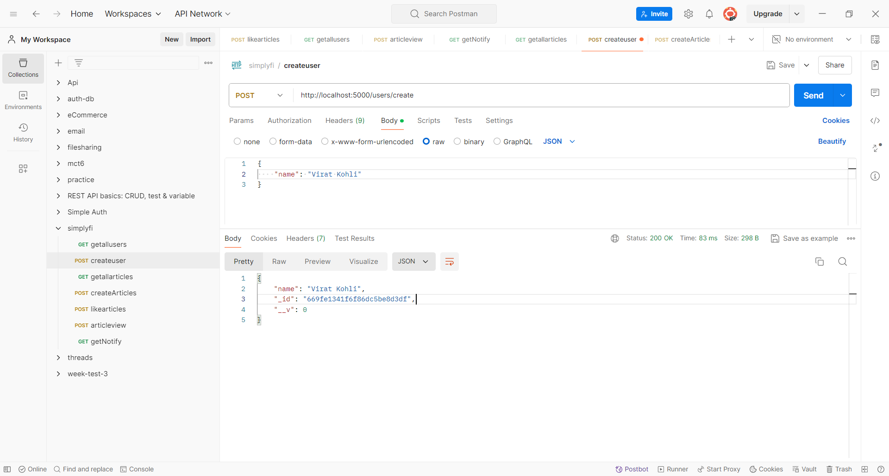
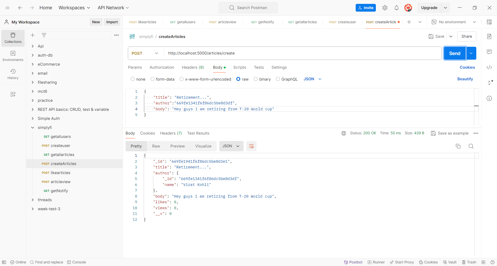
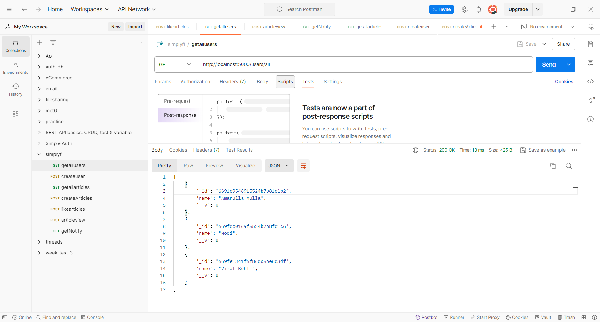
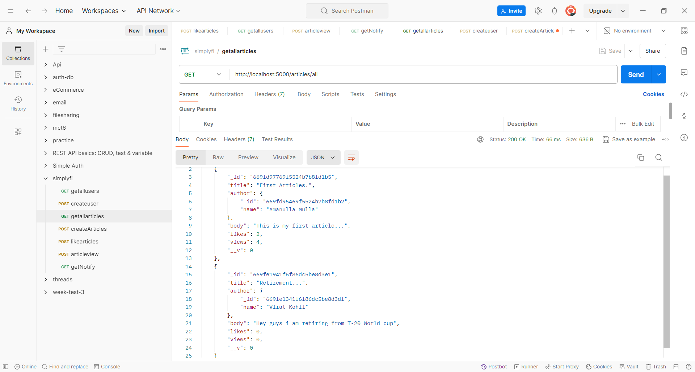
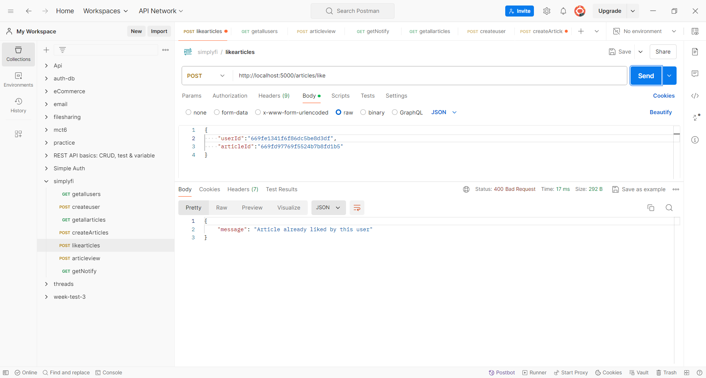
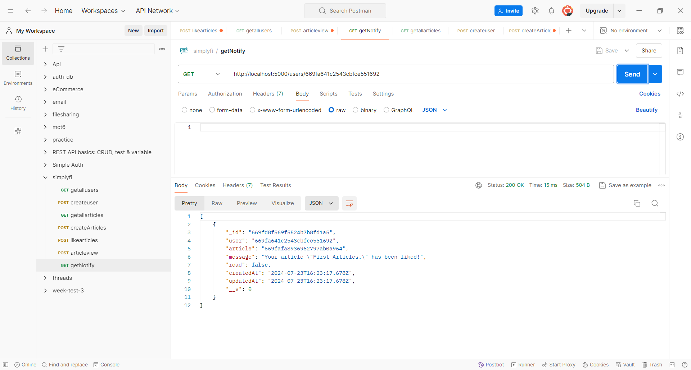

# Article Management System

## Overview

    - This application provides an API for managing articles, user, including functionalities for creating user,articles, liking articles, viewing articles, and receiving notifications. It uses MongoDB with Mongoose for data storage and Express for building the API.

## Features

- Articles: Create and retrieve articles with details including title, body, likes, and views.

- Likes: Users can like articles, with the system ensuring each user can only like an article once.

- Views: Track and update the number of views for each article.

- Notifications: Notify article authors when their articles are liked.

- Users: Manage user information and interactions with articles.

## API Endpoints

### User

    #### Create User
    - POST methods users/create

    #### Get All Users
    - GET methods users/all

    #### Get Liked Notification
    - GET methods users/:userId

### Articles

    #### Create Articles
    - POST methods articles/create

    #### Get All Users
    - GET methods articles/all

    #### Like an Article
    - POST methods articles/like

    #### View an Article
    - GET methods articles/view

## Screen Shots

### Create User

### Create Article

### Get All Users

### Get All Articles

### Like an Article

### Can't Like Again After Liking

### View an Article

### Get Notification After Like

